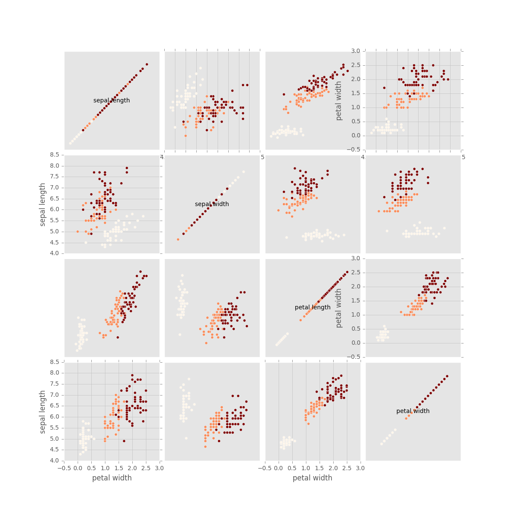
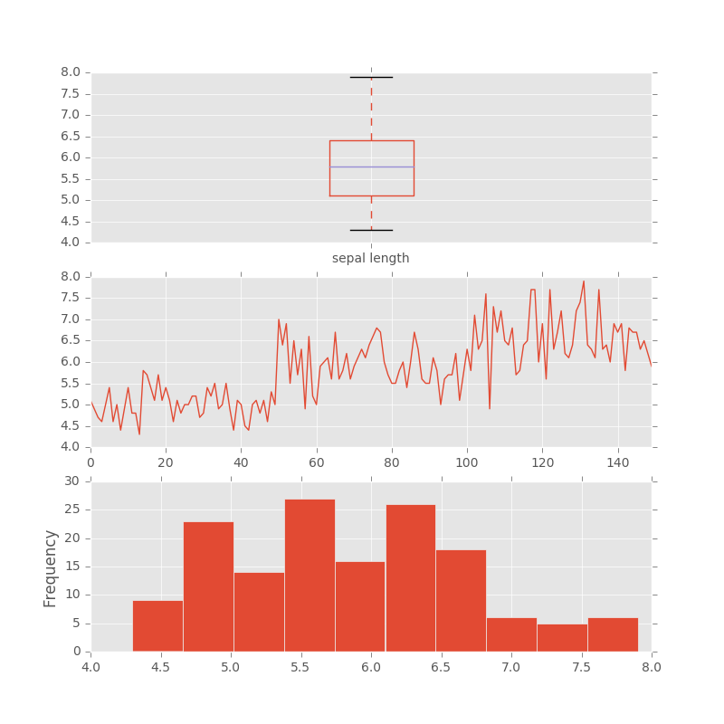
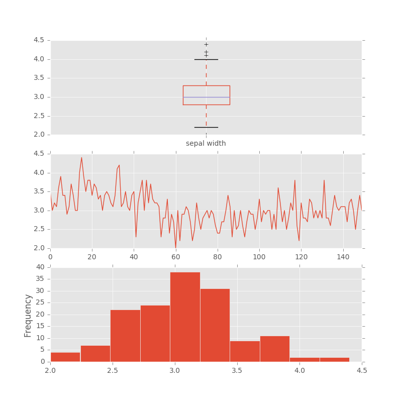
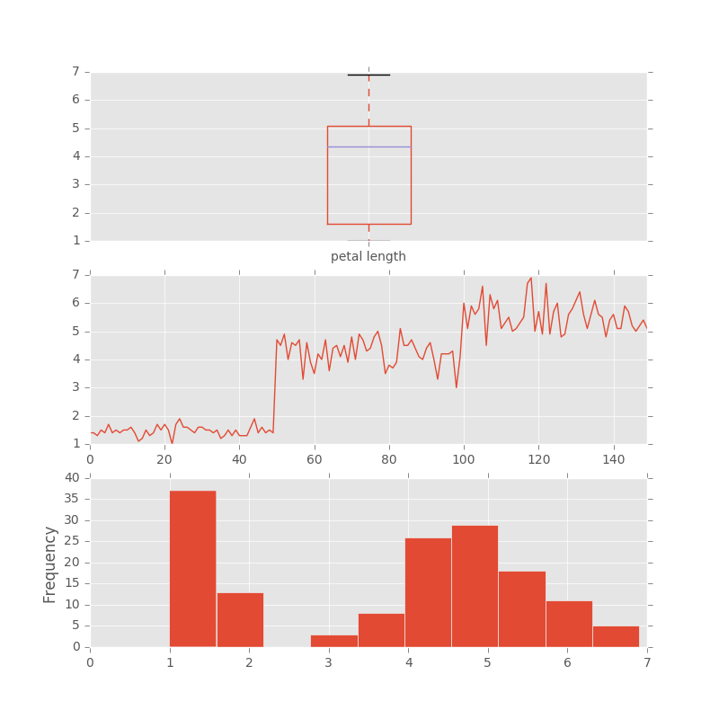
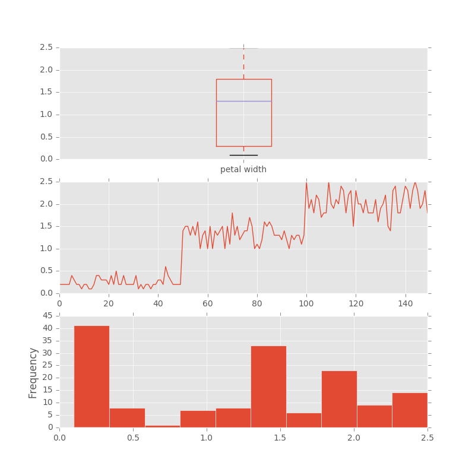
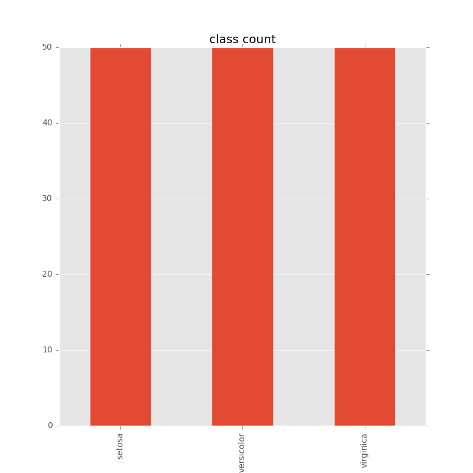

***
iris.data.csv
***

- Number of Records:150
- Number of columns:5
- Empty values:0.000%
- Columns Names:['sepal length', 'sepal width', 'petal length', 'petal width', 'class']

# sepal length
### data_type: float64
### uniq:
4.3, 4.4, 4.5, 4.6, 4.7, 4.8, 4.9, 5.0, 5.1, ..., 6.9, 7.0, 7.1, 7.2, 7.3, 7.4, 7.6, 7.7
### statistic_info:

	max        : 7.9

	mean       : 5.843333333333335

	median     : 5.8

	min        : 4.3

	mode       : 5.0

	mostly accuracy: : 1.0

	mostly type: : Mostly Integer

# sepal width
### data_type: float64
### uniq:
2.0, 2.2, 2.3, 2.4, 2.5, 2.6, 2.7, 2.8, 2.9, ..., 3.5, 3.6, 3.7, 3.8, 3.9, 4.0, 4.1, 4.2
### statistic_info:

	max        : 4.4

	mean       : 3.0540000000000007

	median     : 3.0

	min        : 2.0

	mode       : 3.0

	mostly accuracy: : 1.0

	mostly type: : Mostly Integer

# petal length
### data_type: float64
### uniq:
1.0, 1.1, 1.2, 1.3, 1.4, 1.5, 1.6, 1.7, 1.9, ..., 5.8, 5.9, 6.0, 6.1, 6.3, 6.4, 6.6, 6.7
### statistic_info:

	max        : 6.9

	mean       : 3.7586666666666693

	median     : 4.35

	min        : 1.0

	mode       : 1.5

	mostly accuracy: : 1.0

	mostly type: : Mostly Integer

# petal width
### data_type: float64
### uniq:
0.1, 0.2, 0.3, 0.4, 0.5, 0.6, 1.0, 1.1, 1.2, ..., 1.7, 1.8, 1.9, 2.0, 2.1, 2.2, 2.3, 2.4
### statistic_info:

	max        : 2.5

	mean       : 1.1986666666666672

	median     : 1.3

	min        : 0.1

	mode       : 0.2

	mostly accuracy: : 1.0

	mostly type: : Mostly Integer

# class
### data_type: object
### uniq:
setosa, versicolor, virginica
### statistic_info:

	mode       : setosa;versicolor;virginica

	mostly accuracy: : 0

	mostly type: : Unknown

